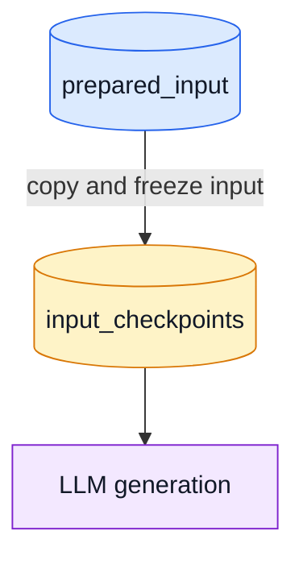

# Mermaid Tool

Create diagrams that communicate data artifacts and recovery behavior without
mixing business lineage with orchestration detail. Favor compatibility with
Miro when diagrams may be copied there.

## First decide diagram purpose

Use separate diagrams when one view cannot stay readable:

- **High-level dataflow:** business source tables, persisted preparation tables,
  transformation process, and serving tables. Omit transport, retries,
  checkpoints, and other technical controls.
- **Checkpoint and fault-tolerance:** show only durable state, fresh versus
  resume branching, incomplete work retention, and publish handoff. Collapse
  shared downstream serving flow into a reference to high-level diagram.

Do not repeat Bronze/Silver/Gold detail in checkpoint view if high-level view
already explains it.

## Labels and artifact conventions

- Use one node per physical source table when source-level traceability matters.
- Use `dataset.table`, not project IDs, unless user asks for full coordinates.
- Persisted table nodes may use two lines:

  ```mermaid
  TABLE["dataset.table\n[logical grain]"]
  ```

- Use square-bracket second line only when grain aids reading. Do not invent
  database primary keys; call them logical grain in surrounding prose when
  inferred from SQL grouping or deduplication.
- Use database/cylinder shape for persisted BigQuery tables:

  ```mermaid
  TABLE[("dataset.table")]
  ```

- Use ordinary rectangles for processes and derived transient datasets.
- LLM itself is a process, not a data artifact. Label it as a verb/process,
  for example `LLM item representation generation`.

## Checkpoint/resume diagrams

Make data state unambiguous:

1. Fresh run prepares final LLM input table.
2. Fresh run copies it into input checkpoint table, freezing intended workload.
3. Each LLM completion persists to results checkpoint table.
4. Resume reads input checkpoint as all intended work and results checkpoint
   as completed work.
5. Remaining work equals input checkpoint minus completed result keys.
6. Send remaining work only to LLM.
7. On incomplete result set, retain both checkpoints for next resume.
8. On complete result set, publish downstream outputs and clear checkpoints.
9. If resume requested but no input checkpoint exists, return to fresh data
   preparation.

Name actual checkpoint tables when known. Avoid grain labels if user wants a
simple fault-tolerance view.

## Miro-compatible Mermaid

Start from conservative flowchart syntax:



Compatibility rules:

- Use quoted node labels containing `\n` for line breaks. Never use HTML
  `<br>` or `<br/>`.
- Use one edge per statement. Avoid chained edges such as `A --> B --> C`,
  because copied renderers may display them poorly.
- Keep edge labels plain. Prefer `No - fresh run` over punctuation-heavy labels
  such as `No: fresh run` if parser errors occur.
- If Miro rejects `classDef` or `:::class`, use one `style NODE ...` statement
  for every node. Do not assume grouped style selectors work.
- Quote labels that contain punctuation, braces, wildcard characters, or line
  breaks.
- If a diagram fails in Miro, reduce syntax before changing logic: remove
  custom classes, HTML, chained edges, then punctuation in edge labels.

## Color vocabulary

Keep colors semantically stable:

- Blue `#DBEAFE` / `#2563EB`: input or derived data
- Yellow `#FEF3C7` / `#D97706`: durable checkpoints
- Purple `#F3E8FF` / `#7E22CE`: process/action
- Pink `#FCE7F3` / `#BE185D`: decision
- Green `#DCFCE7` / `#16A34A`: published sink/handoff
- Red `#FEE2E2` / `#DC2626`: incomplete, rejected, or error state
- Gray `#F3F4F6` / `#6B7280`: start/end/control marker

Use color only for nodes that participate in visible flow. Before delivery,
confirm every colored node has at least one intended incoming or outgoing edge.

## Review checklist

Before returning a Mermaid diagram:

1. Confirm each node is connected as intended.
2. Confirm fresh and resume paths converge only at remaining work or intended
   shared stage.
3. Confirm input and results checkpoints have distinct purpose and arrows.
4. Confirm no HTML break tags exist.
5. Confirm no fragile class syntax if target is Miro.
6. Use one edge per statement and inspect for invalid node identifiers.
7. Explain what the diagram intentionally omits.
